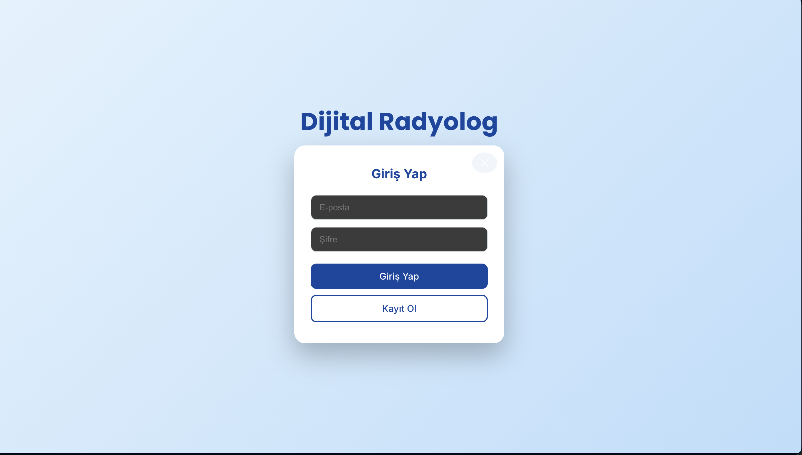
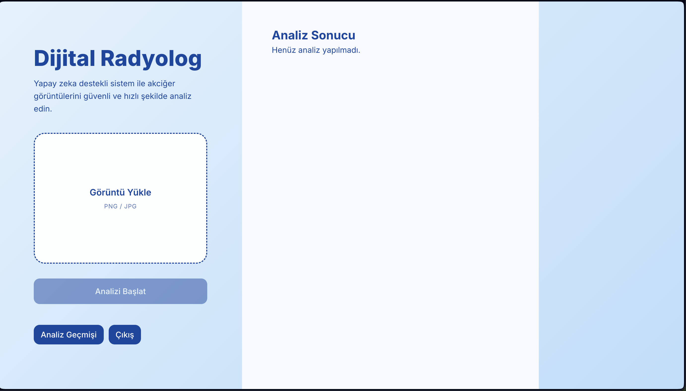
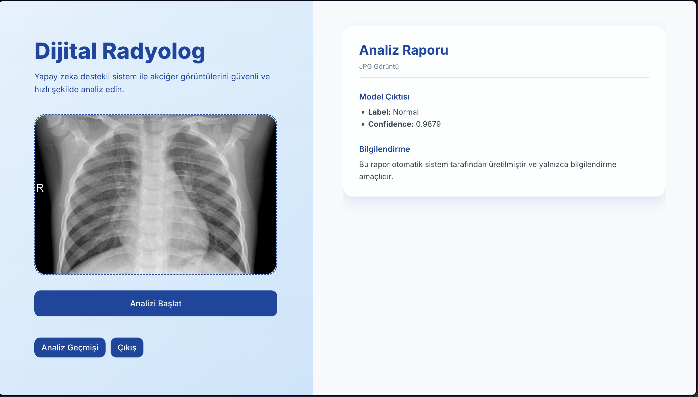
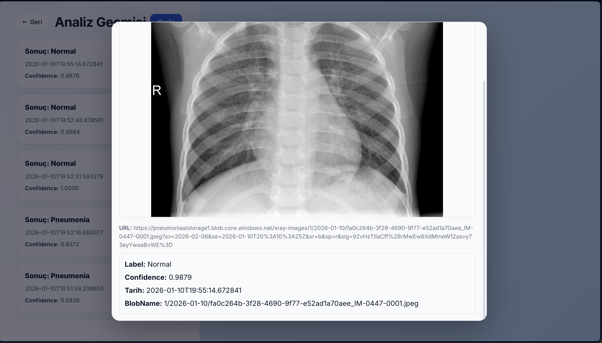

# 🩺 Digital Radiologist – AI Powered Pneumonia Detection Web App

Digital Radiologist is a full-stack AI application that analyzes chest X-ray images and predicts whether a patient has **Pneumonia** or is **Normal**.  
The system is built with a modern micro-service architecture and provides a clean, professional medical UI.

The project includes:
- A React based frontend
- An ASP.NET Core backend API
- A FastAPI AI inference service using an ONNX deep learning model
- Azure Blob Storage for image storage
- Secure authentication & prediction history tracking


## 🚀 System Architecture


```text
Frontend (React)
  |
  v
Backend (ASP.NET Core API)
  |
  +--> Azure Blob Storage (Images)
  |
  +--> AI Inference Service (FastAPI + ONNX Runtime)
```

### 📁 Project Structure


```text
frontend/
 └─ React Application

backend/
 └─ ASP.NET Core API

ai-service/
 └─ FastAPI + ONNX model inference

docker/
 └─ Docker & container configurations

models/
 └─ Trained ONNX model

screenshots/
 └─ UI and system screenshots

docs/
 └─ Technical documents and notes
```

## 🧠 AI Model

- **Model Architecture:** InceptionResNetV2  
- **Task:** Binary classification  
  - Normal  
  - Pneumonia  
- **Input:** Chest X-ray images (224×224 RGB)  
- **Preprocessing:**
  - CLAHE contrast enhancement
  - Grayscale normalization
  - InceptionResNetV2 preprocessing
- **Output:**
  - Label
  - Confidence score

The trained Keras model was converted to ONNX format and served via ONNX Runtime for fast and lightweight inference.


## 🖥️ Frontend Features

- Modern and responsive UI  
- Login & registration system  
- Upload chest X-ray images (PNG / JPG)  
- Real-time AI prediction  
- Prediction confidence display  
- Prediction history tracking  
- Modal preview of uploaded images  
- Professional medical report layout  


## ⚙️ Backend Features
- ASP.NET Core REST API
- JWT authentication
- Image upload handling
- Azure Blob Storage integration
- SAS token generation for secure image access
- Prediction history logging
- Integration with AI inference microservice


## 🔍 AI Inference Service
- Built with FastAPI
- Uses ONNX Runtime
- Exposes /predict endpoint
- Handles image preprocessing
- Returns:
- Label
- Confidence


## ☁️ Cloud Infrastructure
- Azure Blob Storage
- Stores uploaded images
- Private containers
- Secure access via SAS URLs
- Azure Container Apps
- Hosts AI inference service
- Docker-based deployment


## 🛡️ Security
- JWT authentication
- Private blob containers
- Temporary SAS URLs for image access
- Token-based API protection
- No public exposure of storage keys


## 📸 Screenshots

All UI and system screenshots are available inside the screenshots/ directory and show:
- Login screen
- Image upload interface
- Prediction report
- Prediction history
- Image modal preview
- Azure Blob Storage integration

### 🔐 Login Screen


### 📤 Image Upload Interface


### 📊 Prediction Report


### 🕒 Prediction History


### 🖼️ Image Modal Preview



## 🧪 Local Setup (Optional)

### Frontend
```bash
cd frontend
npm install
npm start
```

### Backend
```bash
cd backend
dotnet restore
dotnet run
```

### AI Service
```bash
cd ai-service
pip install -r requirements.txt
uvicorn main:app --host 0.0.0.0 --port 8000
```

## 📌 Technologies Used
| Layer | Tech Stack |
| :--- | :--- |
| **Frontend** | React, CSS |
| **Backend** | ASP.NET Core Web API |
| **AI Service** | FastAPI, ONNX Runtime |
| **ML Model** | TensorFlow, InceptionResNetV2 |
| **Storage** | Azure Blob Storage |
| **Auth** | JWT |
| **Deployment** | Docker, Azure Container Apps |

## ⚠️ Disclaimer
This project is developed for educational and demonstration purposes only.
It is not a medical diagnostic system and must not be used for clinical decisions.

## ⭐ If you like this project, don’t forget to give it a star on GitHub!